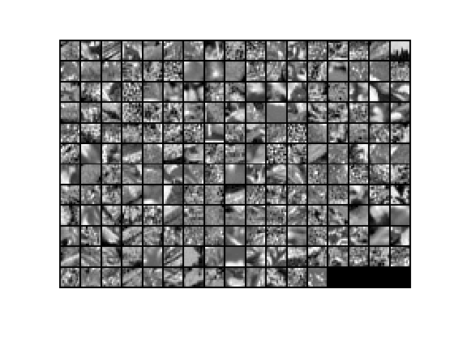
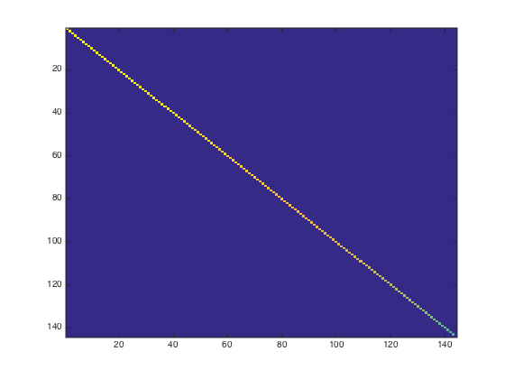

# Exercise:PCA and Whitening

http://ufldl.stanford.edu/wiki/index.php/Exercise:PCA_and_Whitening

In this exercise, you will implement PCA, PCA whitening and ZCA whitening, and apply them to image patches taken from natural images.
You will build on the MATLAB starter code which we have provided in [pca_exercise.zip](http://ufldl.stanford.edu/wiki/resources/pca_exercise.zip). You need only write code at the places indicated by "YOUR CODE HERE" in the files. The only file you need to modify is `pca_gen.m`.

## Step 0: Prepare data

### Step 0a: Load data

The starter code contains code to load a set of natural images and sample 12x12 patches from them. The raw patches will look something like this:


These patches are stored as column vectors x^{(i)} \in \mathbb{R}^{144} in the 144 \times 10000 matrix x.

### Step 0b: Zero mean the data

First, for each image patch, compute the mean pixel value and subtract it from that image, this centering the image around zero. You should compute a different mean value for each image patch.

## Step 1: Implement PCA

### Step 1a: Implement PCA

In this step, you will implement PCA to obtain xrot, the matrix in which the data is "rotated" to the basis comprising the principal components (i.e. the eigenvectors of Σ). Note that in this part of the exercise, you should not whiten the data.

### Step 1b: Check covariance

To verify that your implementation of PCA is correct, you should check the covariance matrix for the rotated data xrot. PCA guarantees that the covariance matrix for the rotated data is a diagonal matrix (a matrix with non-zero entries only along the main diagonal). Implement code to compute the covariance matrix and verify this property. One way to do this is to compute the covariance matrix, and visualise it using the MATLAB command imagesc. The image should show a coloured diagonal line against a blue background. For this dataset, because of the range of the diagonal entries, the diagonal line may not be apparent, so you might get a figure like the one show below, but this trick of visualizing using imagesc will come in handy later in this exercise.


## Step 2: Find number of components to retain

Next, choose k, the number of principal components to retain. Pick k to be as small as possible, but so that at least 99% of the variance is retained. In the step after this, you will discard all but the top k principal components, reducing the dimension of the original data to k.

## Step 3: PCA with dimension reduction

Now that you have found k, compute \tilde{x}, the reduced-dimension representation of the data. This gives you a representation of each image patch as a k dimensional vector instead of a 144 dimensional vector. If you are training a sparse autoencoder or other algorithm on this reduced-dimensional data, it will run faster than if you were training on the original 144 dimensional data.

To see the effect of dimension reduction, go back from \tilde{x} to produce the matrix \hat{x}, the dimension-reduced data but expressed in the original 144 dimensional space of image patches. Visualise \hat{x} and compare it to the raw data, x. You will observe that there is little loss due to throwing away the principal components that correspond to dimensions with low variation. For comparison, you may also wish to generate and visualise \hat{x} for when only 90% of the variance is retained.



## Step 4: PCA with whitening and regularization

### Step 4a: Implement PCA with whitening and regularization

Now implement PCA with whitening and regularization to produce the matrix xPCAWhite. Use the following parameter value:

```matlab
epsilon = 0.1
```

### Step 4b: Check covariance

Similar to using PCA alone, PCA with whitening also results in processed data that has a diagonal covariance matrix. However, unlike PCA alone, whitening additionally ensures that the diagonal entries are equal to 1, i.e. that the covariance matrix is the identity matrix.

That would be the case if you were doing whitening alone with no regularization. However, in this case you are whitening with regularization, to avoid numerical/etc. problems associated with small eigenvalues. As a result of this, some of the diagonal entries of the covariance of your xPCAwhite will be smaller than 1.

To verify that your implementation of PCA whitening with and without regularization is correct, you can check these properties. Implement code to compute the covariance matrix and verify this property. (To check the result of PCA without whitening, simply set epsilon to 0, or close to 0, say 1e-10). As earlier, you can visualise the covariance matrix with imagesc. When visualised as an image, for PCA whitening without regularization you should see a red line across the diagonal (corresponding to the one entries) against a blue background (corresponding to the zero entries); for PCA whitening with regularization you should see a red line that slowly turns blue across the diagonal (corresponding to the 1 entries slowly becoming smaller).



## Step 5: ZCA whitening

Now implement ZCA whitening to produce the matrix xZCAWhite. Visualize xZCAWhite and compare it to the raw data, x. You should observe that whitening results in, among other things, enhanced edges. Try repeating this with epsilon set to 1, 0.1, and 0.01, and see what you obtain. The example shown below (left image) was obtained with epsilon = 0.1.


